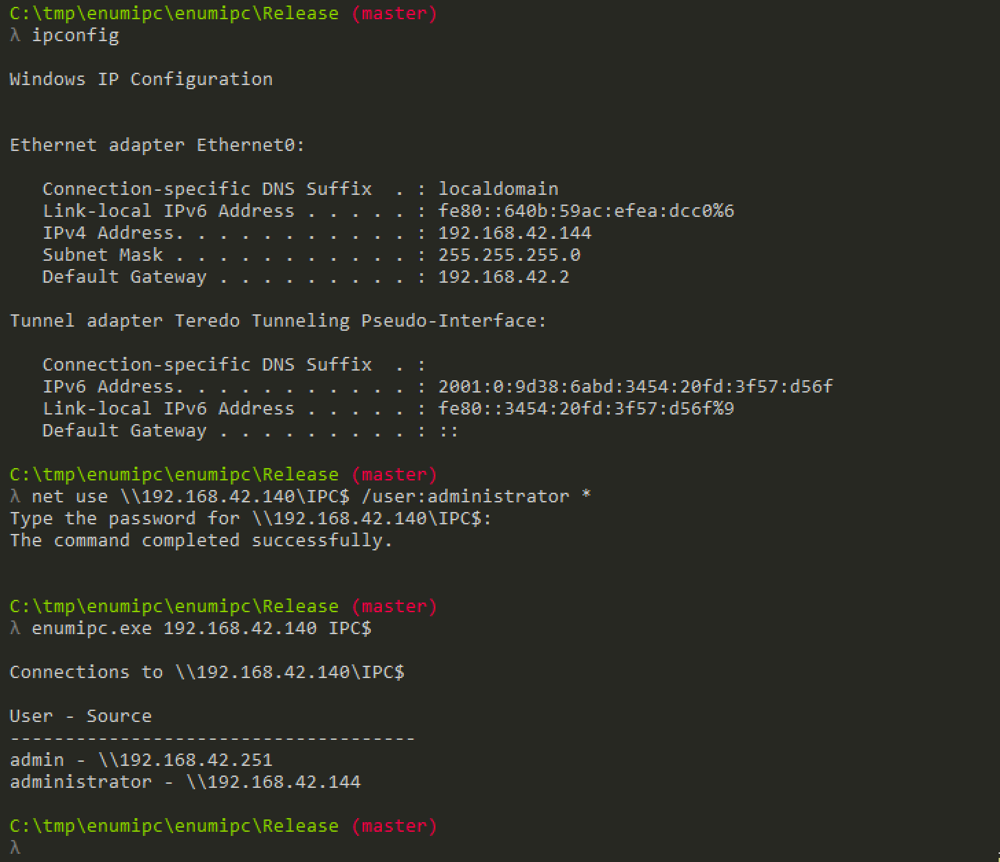

# enumipc

`enumipc.exe` is a small utility to list connections to a Windows share. It is pretty much the sample code from the [`NetConnectionEnum()`](https://docs.microsoft.com/en-us/windows/desktop/api/lmshare/nf-lmshare-netconnectionenum) example.

Several Emotet malware write-ups indicate Emotet will query the IPC$ share to get a list of all endpoints that connect to it. This gives Emotet more hosts to potentially spread to (and usernames to use in brute-force attacks). I was curious how this worked, which is how this started.

In the example below, we query `192.168.42.140` and see there are two users connected from two hosts:

```
C:\tmp\enumipc\enumipc\Release> enumipc.exe 192.168.42.140 IPC$

Connections to \\192.168.42.140\IPC$

User - Source
-------------------------------------
admin - \\192.168.42.251
administrator - \\192.168.42.144
```


